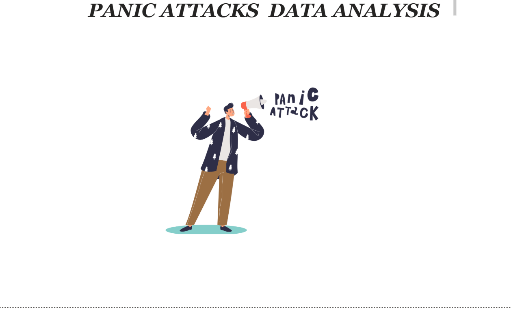
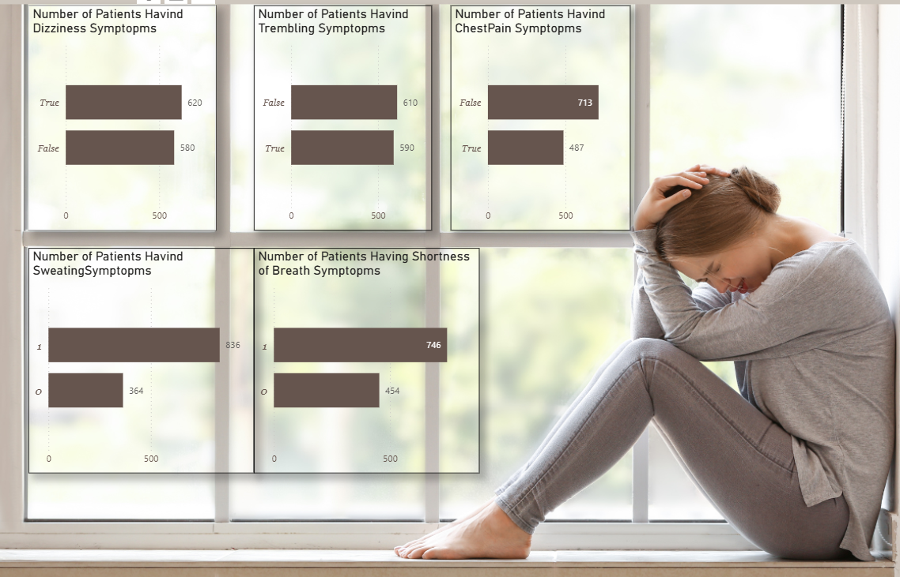
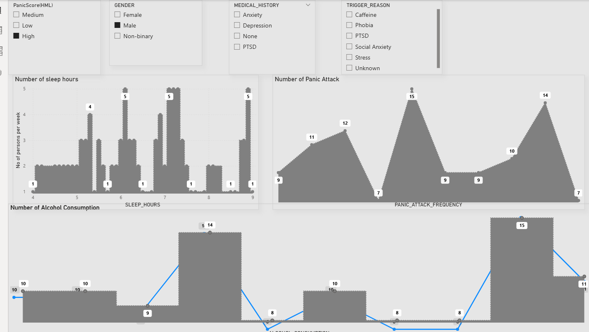
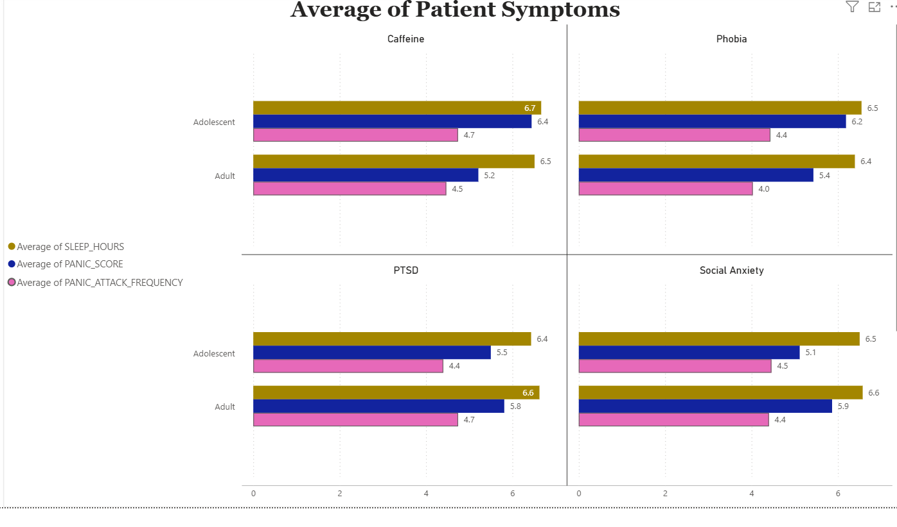

# 🚨 Panic Attacks Data Analysis (Snowflake + Power BI)

📊 An end-to-end **healthcare analytics project** built using **Snowflake and Power BI**, focused on analyzing **panic attacks, symptoms, triggers, and patient behavior patterns** to support data-driven mental health insights.

---

## 📌 Project Overview
This project is part of ** Panic Attacks Data Analysis (Data Source: Snowflake)** from a data analytics course.  
The project demonstrates how to **load data into Snowflake**, query it using SQL, connect it to **Power BI**, perform transformations, and build **multi-page analytical reports**.

---

## 🎯 Business / Analytical Objectives
- Understand panic attack patterns across patients  
- Analyze common symptoms and trigger factors  
- Study the relationship between sleep, alcohol, anxiety, and panic frequency  
- Compare panic severity across age groups and medical histories  

---

## 🧠 Key Analysis Areas
- **Symptoms Analysis**: Dizziness, trembling, chest pain, sweating, shortness of breath  
- **Panic Frequency**: Number of panic attacks and severity levels  
- **Lifestyle Factors**: Sleep hours and alcohol consumption  
- **Medical History**: Anxiety, PTSD, phobia, social anxiety  
- **Demographics**: Gender and age group analysis  

---

## 🛠 Tools & Skills Used
- Snowflake (data storage & SQL analysis)  
- Power BI  
- Power Query (data cleaning & transformations)  
- DAX (IF, SWITCH, COUNTROWS, FILTER, DIVIDE)  
- Slicers & interactive filters  
- Multi-page report design  

---

## 📊 Report Pages
- Overview & Symptoms Analysis  
- Panic Attack Frequency Analysis  
- Lifestyle & Trigger Analysis  
- Age Group Analysis  

Each page supports interactive filtering by:
- Panic score level  
- Gender  
- Medical history  
- Trigger reason  

---

## 📸 Report Screenshots

### 🚨 Report Cover Page

---

### 🧠 Symptoms Analysis Dashboard

---

### 📊 Age Group & Medical History Analysis

---

### 📉 Average Patient Symptoms Comparison

---

## ▶️ How to Use
1. Open the Power BI report file (`.pbix`)  
2. Ensure Snowflake connection credentials are configured  
3. Refresh the dataset  
4. Use slicers to explore patterns and insights  
5. Navigate through report pages for detailed analysis  

---

## 🎓 Learning Outcomes
- Hands-on Snowflake + Power BI integration  
- Advanced data transformation using Power Query  
- DAX calculations for healthcare analytics  
- Multi-dimensional analysis of mental health data  
- Real-world healthcare analytics project for portfolio  

---

